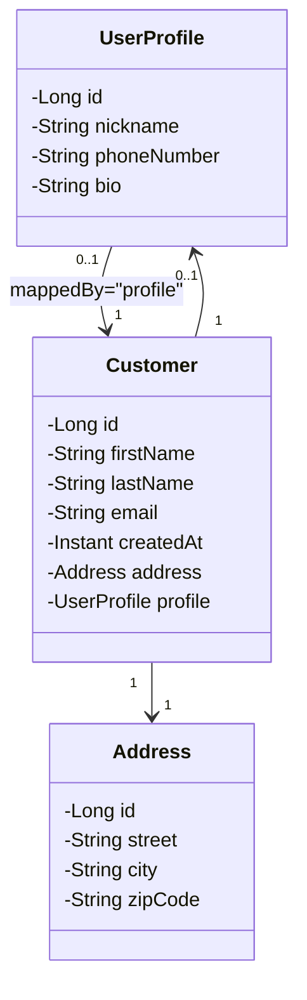

 
# 🛒 E‑commerce Platform — JPA (Part 1)

A Spring Boot application demonstrating **JPA entity mapping**, **One‑to‑One relationships**, and **repository queries** using MySQL.  
This is Part 1 of a multi‑step workshop building an E‑commerce platform.

---

## 🚀Technologies
- Java 25
- Spring Boot 4
- Spring Data JPA
- Hibernate
- MySQL
- Lombok
- Maven

---

## 📘 Project Instructions

👉 [View project instructions](SpringBoot-DataJPA-Workshop-Part1.md) 

---

## 📌 Objectives (Part 1)

- Implement the core domain model:
  - `Customer`
  - `Address`
  - `UserProfile`
- Configure **One‑to‑One** relationships:
  - Unidirectional: `Customer → Address`
  - Bidirectional: `Customer ↔ UserProfile`
- Apply correct JPA annotations and database constraints.
- Create repository interfaces with derived query methods.
- Verify persistence, cascading, and queries using a `CommandLineRunner`.

---

## 📂 Folder Structure
```
src/main/java/se/lexicon
│
├── entity
│   ├── Address.java
│   ├── Customer.java
│   └── UserProfile.java
│
├── repository
│   ├── AddressRepository.java
│   ├── CustomerRepository.java
│   └── UserProfileRepository.java
│
└── Main.java
```

## 🧱 Domain Model Overview

### **Customer**
- Primary entity representing a user in the system.
- Contains personal info and references to Address and UserProfile.

### **Address**
- Standalone entity.
- Represents shipping/billing address.
- Unidirectional relationship from Customer.

### **UserProfile**
- Optional additional information for a Customer.
- Bidirectional One‑to‑One relationship.

---

## 📊 UML Class Diagram (from assignment)



---
## 🗄️ Database Schema (ER Diagram)

- `customers`  
- `addresses`  
- `user_profiles`

Foreign keys:
- `customers.address_id`
- `customers.profile_id`

---
## 🧪 Testing (Part 1)
A CommandLineRunner is included to:
- Create sample Customer, Address, and UserProfile
- Persist them using cascading
- Execute all repository queries
- Print results to the console

This verifies:
- Schema generation
- Relationship correctness
- Cascade behavior
- Query method functionality

---
## ▶️ How to Run

1. Clone the repository
2. Configure MySQL in `application.properties`
3. Create a database named:

```sql
CREATE DATABASE ecommerce;
```

4. Run the application from `Main.java`

---

## ✅ Status

Part 1 completed successfully.

Features tested:
- Entity persistence
- One-to-One relationships
- Cascading
- Derived query methods
- MySQL integration

